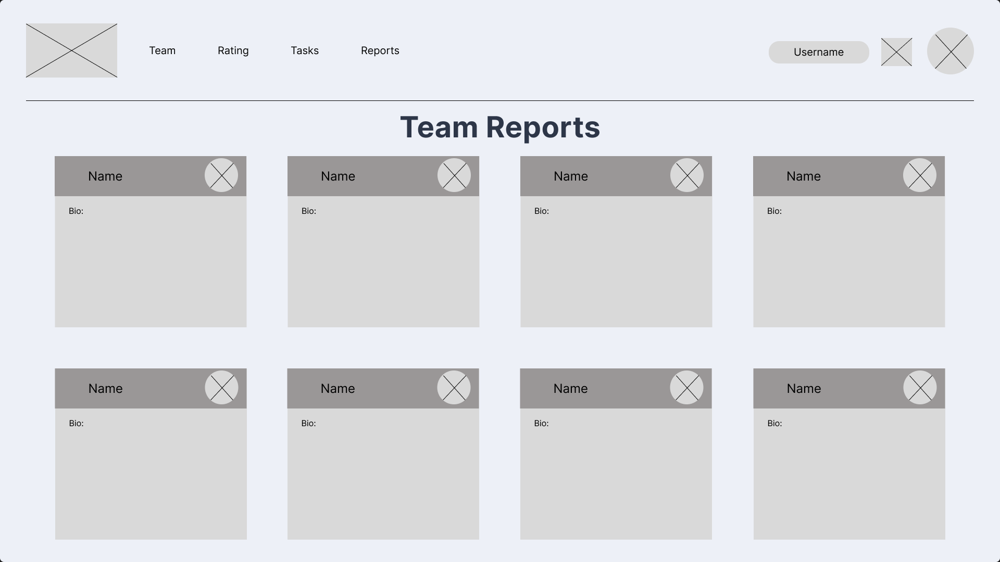

Nesta atividade ponderada da semana 2, exploraremos a concepção de uma tela wireframe centrada na comunicação de imprevistos e situações similares. A tela em questão, denominada "Reports", visa proporcionar um espaço dedicado onde os membros de um grupo possam compartilhar atualizações cruciais sobre sua disponibilidade, permitindo uma adaptação mais eficiente às mudançasinesperadas.

A tela "Reports" é projetada para ser acessível através de um botão dedicado, facilitando a navegação dos usuários. Ao ser acionada, os usuários são direcionados para uma página que oferece uma plataforma para comunicar imprevistos, como a indisponibilidade temporária de um membro devido a circunstâncias imprevistas. Por exemplo, um membro pode informar que estará offline por um determinado período de tempo devido a uma emergência ou compromisso inadiável. Essa funcionalidade permite que o grupo permaneça informado sobre a disponibilidade de cada membro, promovendo uma comunicação transparente e eficaz.

Em suma, a tela "Reports" desempenha um papel crucial na facilitação da comunicação e na adaptação às mudanças de disponibilidade dentro de um grupo. Ao permitir que os membros compartilhem atualizações importantes, como indisponibilidades temporárias, a tela ajuda a garantir que todos estejam cientes e possam ajustar seus planos de acordo. Essa funcionalidade é vital para manter a fluidez da comunicação e garantir o progresso contínuo do projeto. Portanto, a tela "Reports" é uma ferramenta essencial que atende à necessidade de comunicar avisos e imprevistos, contribuindo para a transparência e a eficiência no gerenciamento de projetos.

